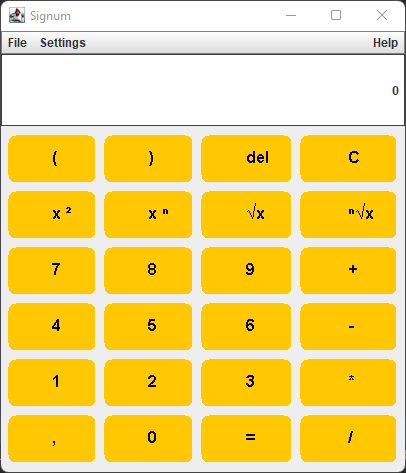

## About Calculator

<!-- PROJECT LOGO -->
<br />
<div align="center">
  <a href="https://github.com/FelixHoff1988/Calculator">
    
  </a>

<h3 align="center">Calculator</h3>
<h4 align="center">Work in progress</h4>
  <p align="center">
    The aim of this project is to develop a calculator for use in schools and could replace physical scientific calculators in the classroom. Physical scientific calculators often have a range of functions that is overloaded for school lessons. With this calculator, it should be possible in the future to control the range of functions remotely by the teacher, so that the range of functions can be individually adapted to the learning group.

Furthermore, the calculator will have an exam mode in the future. The teacher should be able to use log files to determine whether other apps were opened on the students' devices during the exam mode in order to prevent attempts at deception.

The calculator will be available for iOS and Android 

</p>
    <br />
    <a href="https://github.com/FelixHoff1988/Calculator"><strong>Explore the docs »</strong></a>
    <br />
    <br />
    <a href="https://github.com/FelixHoff1988/Calculator">View Demo</a>
    ·
    <a href="https://github.com/FelixHoff1988/Calculator/issues">Report Bug</a>
    ·
    <a href="https://github.com/FelixHoff1988/Calculator/issues">Request Feature</a>
  </p>
</div>

<p align="right">(<a href="#top">back to top</a>)</p>

<!-- GETTING STARTED -->
## Getting Started

To get a local copy up and running follow these simple example steps.

### Prerequisites

* Java version 8 or higher

### Installation

1. Get and install latest Java JDK version at [https://www.oracle.com/java/technologies/downloads/](https://www.oracle.com/java/technologies/downloads/)
2. Clone the repo
   ```sh
   git clone https://github.com/FelixHoff1988/Calculator.git
   ```
3. Imported it in Intellij IDEA or any other Java IDE.
4. Compile and run the application

<p align="right">(<a href="#top">back to top</a>)</p>

<!-- ROADMAP -->
## Roadmap

- [x] Basic arithmetic operations
    - [x] addition
    - [x] substraction
    - [x] multiplication
    - [x] division
    - [x] equals
    - [x] delete
    - [x] clear
- [x] Dyck language (Brackets)
- [x] GUI
    - [x] Basic swing GUI
    - [ ] Custom buttons
    - [ ] Android GUI
    - [ ] iOS GUI
 - [ ] Advanced arithmetric operations
    - [ ] power x^2
    - [ ] power x^n
    - [ ] root x^1/2
    - [ ] root x^1/n
    - [ ] sin
    - [ ] cos
    - [ ] tan
    - [ ] Log 10
    - [ ] log e
    - [ ] log x
 - [ ] Remote App
    - [ ] control panel
    - [ ] exam mode
    - [ ] account system
    - [ ] server socket

See the [open issues](https://github.com/FelixHoff1988/Calculator/issues) for a full list of proposed features (and known issues).

<p align="right">(<a href="#top">back to top</a>)</p>

<!-- CONTACT -->
## Contact

Felix Hoff - felixjacobhoff@gmail.com

Project Link: [https://github.com/FelixHoff1988/Calculator](https://github.com/FelixHoff1988/Calculator)

<p align="right">(<a href="#top">back to top</a>)</p>
